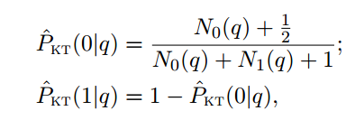
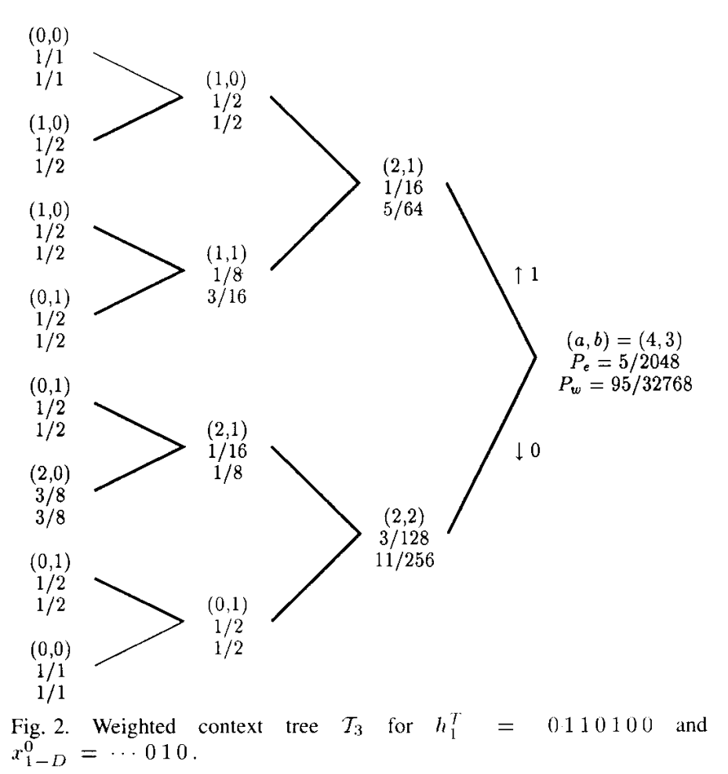
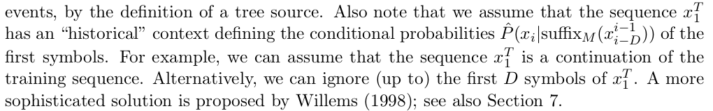
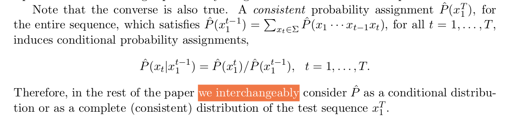

# ctw
Implementation of the Context Tree Weighting algorithm as described in the
[paper by M. J. Willems](http://citeseerx.ist.psu.edu/viewdoc/summary?doi=10.1.1.30.1819).

## Install and run unit tests
Requires the javascript `node` environment.

```
git clone git@github.com:andrewrocks/ctw.git
cd ctw
npm install
npm test
```

## Krichevsky–Trofimov estimator
We compute the KT estimator with the recursive function shown on 
[wikipedia](https://en.wikipedia.org/w/index.php?title=Krichevsky%E2%80%93Trofimov_estimator&oldid=753863516).


And there's another way to write the formula



which we see in [On Prediction Using Variable Order Markov Models](https://www.jair.org/media/1491/live-1491-2335-jair.pdf).

We test the implementation against examples from 
Data Compression: The Complete Reference.


## Example Tree
Our code can compute the _estimated probability_ and _weighted probability_
for every node in the tree, just like in this diagram from the paper.


## How we build the trees
We don't. There are no trees. There doesen't seem to be some certain fancy
way of building them either. Have a look at the 
[On Prediction Using Variable Order Markov Models](https://www.jair.org/media/1491/live-1491-2335-jair.pdf)
paper:

They put into the tree every context seen in the given string without hesitating.
Even the paper includes the nodes for contexts that don't even occur in the tree.

## Initial Context
Because the algorithm requires an initial context for the string to be
processed, we chop away D bits from the strings to use as context, the way they do
in the [prediction paper](https://www.jair.org/media/1491/live-1491-2335-jair.pdf), 


## Prediction
Intuitivley we would have expected to see more conditional probability 
assignments in the CTW paper, but apparently they can simply be implicit.
In [On Prediction Using Variable Order Markov Models](https://www.jair.org/media/1491/live-1491-2335-jair.pdf), 
they actually say that they switch between a complete probability distribution
and a conditional one interchangebly.


## To improve
We're computing the KT estimate with a recursive function.
A memoized recursive function might not be the best
way to compute these values. The cache could grow very
large (or very sparse if the library throws our results).
A better way might be to update the probabilities in
the counts directly the way other libraries to it.
