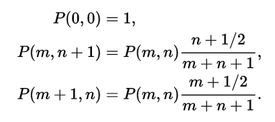
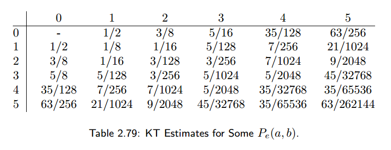
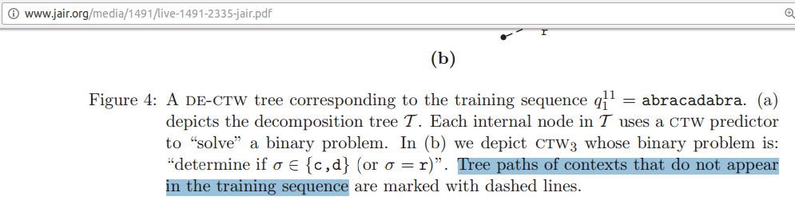

# ctw
Implementation of the Context Tree Weighting algorithm.

## Install and run unit tests

Requires the javascript `node` environment.

```
git clone git@github.com:andrewrocks/ctw.git
cd ctw
npm install
npm test
```

## Krichevsky–Trofimov estimator
We compute the KT estimator with the recursive function shown on 
[wikipedia](https://en.wikipedia.org/w/index.php?title=Krichevsky%E2%80%93Trofimov_estimator&oldid=753863516).


We test the implementation against examples from 
Data Compression: The Complete Reference.


## How we build the trees
We don't. There are no trees. There doesen't seem to be some certain fancy
way of building them either. Have a look at the 
_On Prediction Using Variable Order Markov Models_ paper (snippet in `doc/`):

They put into the tree every context seen in the given string without hesitating.
Even the paper includes the nodes for contexts that don't even occur in the tree.

## To improve
We're computing the KT estimate with a recursive function.
A memoized recursive function might not be the best
way to compute these values. The cache could grow very
large (or very sparse if the library throws our results).
A better way might be to update the probabilities in
the counts directly the way other libraries to it.